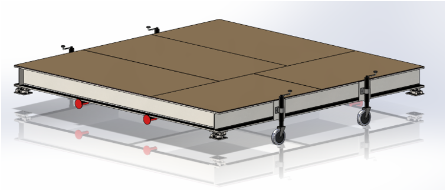

# Info

This folder contains the final report and the FEA report that was done as part of the fire and rescue project. The project was to design a platform that can hold a load of 8 tonnes on top of it. The final report was a group report completed with the help of other group members. I was responsible for the FEA section of the project and completed all work related to that. This included the completeion of CAD and the FEA analysis fo the platform.

Below is a prototype design of the platform.

The simplified design of the platform was used for FEA analysis. This is shown below.

